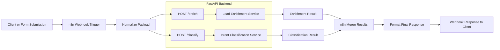

# Lead Automation API

This repository contains a lightweight FastAPI backend and an `n8n` workflow export for a simple lead-processing demo. The backend exposes two API endpoints:

- `/enrich` for mock lead enrichment
- `/classify` for lightweight message intent classification

The included workflow shows how an automation tool can receive an inbound payload, call both API endpoints, merge the results, and return a combined response.

## Repository Contents

- `main.py` - `uvicorn` entrypoint
- `app/` - FastAPI package with routes, models, and business logic
- `workflows/Lead Automation.json` - exported `n8n` workflow
- `requirements.txt` - Python dependencies

## Setup Instructions

### 1. Create and activate a virtual environment

```powershell
python -m venv venv
.\venv\Scripts\Activate.ps1
```

### 2. Install dependencies

```powershell
pip install -r requirements.txt
```

### 3. Run the FastAPI server

```powershell
uvicorn main:app --reload
```

The API will be available at `http://127.0.0.1:8000`.

### 4. Open interactive docs

- Swagger UI: `http://127.0.0.1:8000/docs`
- ReDoc: `http://127.0.0.1:8000/redoc`

## API Documentation

### `GET /`

Health check endpoint.

Example response:

```json
{
  "message": "API is working"
}
```

### `POST /enrich`

Returns mock enrichment data for a lead.

Example request:

```json
{
  "name": "Jane Doe",
  "email": "jane@example.com",
  "company": "Acme"
}
```

Example response:

```json
{
  "linkedin_url": "https://linkedin.com/in/janedoe",
  "company_size": "51-200",
  "industry": "SaaS"
}
```

### `POST /classify`

Classifies the intent of an inbound message.

Example request:

```json
{
  "message": "We are interested in buying your product."
}
```

Example response:

```json
{
  "intent": "sales_enquiry",
  "confidence": 0.9
}
```

## Architecture Explanation

The solution is split into two simple layers:

1. FastAPI backend
   - `app/models.py` defines request schemas.
   - `app/routes.py` defines HTTP endpoints.
   - `app/services.py` holds business logic so route handlers stay thin.
   - `app/api.py` creates and configures the FastAPI application.
   - `main.py` exposes the application object for local development and deployment.

2. `n8n` workflow
   - A webhook receives lead data and message text.
   - A normalization step reshapes the inbound payload.
   - Two HTTP Request nodes call `/enrich` and `/classify` in parallel.
   - The workflow merges both outputs and returns a single response payload.

This structure keeps the backend easy to explain in a walkthrough and makes it straightforward to swap the mock logic with real enrichment or LLM-backed classification later.

## Workflow Architecture Diagram



### Diagram Notes

- The workflow starts when `n8n` receives a webhook payload containing lead details and a message.
- A normalization step shapes the incoming data into the format expected by the FastAPI endpoints.
- `n8n` calls `/enrich` and `/classify` independently, which keeps the backend responsibilities small and focused.
- After both API calls return, the workflow merges the outputs and responds with one combined JSON payload.

## Running the n8n Workflow

1. Start the FastAPI app locally on port `8000`.
2. Import `workflows/Lead Automation.json` into `n8n`.
3. Update the HTTP Request node URLs if your API is not reachable at `http://host.docker.internal:8000`.
4. Trigger the webhook with a payload like:

```json
{
  "name": "Jane Doe",
  "email": "jane@example.com",
  "company": "Acme"
}
```

The workflow returns the original lead info plus enrichment and classification results.


